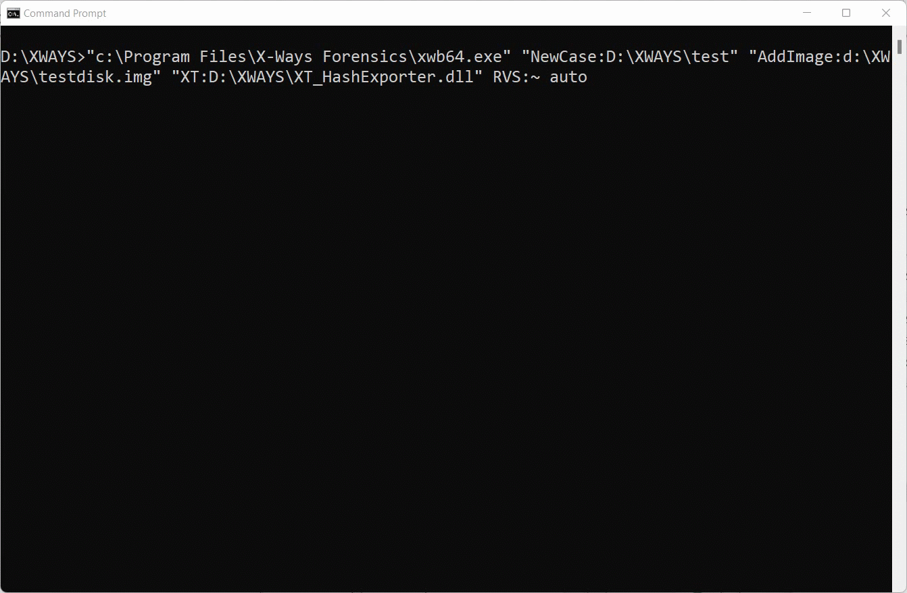

# X-Ways-HashExporter-Extension
This X-Ways Forensics extension automates the export of hashes from an image
While the extension could be run from the X-Ways gui, it can also be run from the command-line.

<code>D:\XWAYS>"c:\Program Files\X-Ways Forensics\xwb64.exe" "NewCase:D:\XWAYS\test" "AddImage:d:\XWAYS\testdisk.img" "XT:D:\XWAYS\XT_HashExporter.dll" RVS:~ auto</code>

Details on running this XWF extension can be found on our blog : 
https://www.politoinc.com/post/introducing-hash-exporter-for-x-ways-automate-your-hash-lists

## License
Polito Inc. is providing the HashExporter extension ("this Software") for free for the benefit of the Digital Forensics community. This Software is provided "as is", without any warranty of any kind, express or implied. You may copy, distribute, and use this Software without charge for commercial or non-commercial purposes, provided that you give full credit to its source and you do not sell, rent, or lease it. While we are unable to provide support for this Software, feel free to contact us at  <b>info(at)politoinc.com</b>  with any bug reports or feature requests. Also feel free to contact us if you have suggestions for other X-Ways extensions. 

Hashes of the files : 

  MD5      9C54E8F431983CEA3D8BF298898A6BEA                 XT_HashExporter.dll

 After running plugin, output of results are in a file : casename_Hashes.txt

<!-- See blog post here for more details and instructions for how to use this extension in X-Ways: -->

